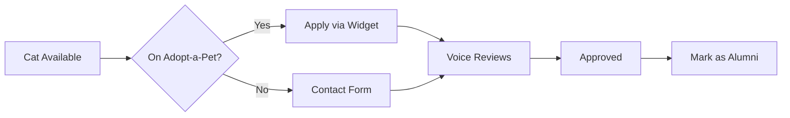

# Adopt-a-Pet Widget Integration

## Overview

This document describes the integration between Kelsey's Cats foster home website and Voice for the Voiceless' Adopt-a-Pet profile.

## Implementation Strategy: Option B (Widget + Disclaimer)

### Why This Approach?

1. **API Limitation**: Adopt-a-Pet discontinued new API key generation in 2021
2. **Simple & Reliable**: Widget is officially supported and auto-updates
3. **Zero Maintenance**: No manual sync or backend complexity
4. **Compliance**: Follows Adopt-a-Pet's recommended integration method

---

## How It Works

### Frontend Display (`/cats` page)

**Section 1: Our Foster Cats** 🏠
- Shows cats from your database (status: available)
- Custom design with full control
- Beautiful card layout
- Each cat has "View Details" button → individual cat page

**Section 2: Voice for the Voiceless Cats** 🐾
- Embedded Adopt-a-Pet widget
- Shows ALL cats from Voice for the Voiceless shelter
- Includes disclaimer about possible duplicates
- Links to full shelter profile

### Cat Detail Page Adoption Buttons

Cats can have one of two adoption paths:

#### **Option A: Cat Has Adopt-a-Pet Profile**
```jsx
<Button href={cat.adoptapet_url} target="_blank">
  Apply on Adopt-a-Pet →
</Button>
<TextSmall>Via Voice for the Voiceless</TextSmall>
```

#### **Option B: Cat NOT on Adopt-a-Pet Yet**
```jsx
<ButtonLink to="/contact">
  Contact to Adopt
</ButtonLink>
<TextSmall>Direct adoption inquiry</TextSmall>
```

---

## Database Schema

### New Column: `adoptapet_url`

```sql
ALTER TABLE cats 
ADD COLUMN adoptapet_url VARCHAR(500) NULL;
```

**Purpose**: Track which cats have Adopt-a-Pet profiles

**Usage**:
- `NULL` = Cat not yet on Adopt-a-Pet (show "Contact Us" button)
- `URL` = Cat on Adopt-a-Pet (show "Apply on Adopt-a-Pet" button)

**Example**:
```sql
UPDATE cats 
SET adoptapet_url = 'https://www.adoptapet.com/pet/12345678-whiskers-schenectady-ny' 
WHERE id = 52;
```

---

## Admin Workflow

### Adding a New Foster Cat

1. **Add cat to database** (via Admin Panel or CSV import)
   - Name, age, breed, photos, description
   - Leave `adoptapet_url` empty initially
   - Cat shows "Contact to Adopt" button

2. **Request Voice for the Voiceless list cat on Adopt-a-Pet**
   - Provide cat details to shelter admin
   - Wait for profile creation

3. **Update cat with Adopt-a-Pet URL** (when available)
   - Copy URL from Adopt-a-Pet profile
   - Edit cat in Admin Panel
   - Paste URL in "Adopt-a-Pet Profile URL" field
   - Cat now shows "Apply on Adopt-a-Pet" button

### Cat Adoption Flow



---

## Widget Configuration

### Current Settings

```html
<iframe 
  src="https://searchtools.adoptapet.com/cgi-bin/searchtools.cgi/portable_pet_list?shelter_id=184939&title=&color=green&size=800x600_list&sort_by=pet_name"
  title="Voice for the Voiceless Adoptable Cats"
  loading="lazy"
/>
```

### Parameters

| Parameter | Value | Description |
|-----------|-------|-------------|
| `shelter_id` | `184939` | Voice for the Voiceless shelter ID |
| `title` | `` (empty) | No title shown (we add our own) |
| `color` | `green` | Widget theme color |
| `size` | `800x600_list` | List view, 800px wide |
| `sort_by` | `pet_name` | Alphabetical by name |

### Customization Options

If you want to change the widget appearance:

**Available colors**: `red`, `blue`, `green`, `purple`, `orange`

**Available layouts**:
- `800x600_list` - List view (current)
- `800x600_grid` - Grid view
- `500x600_list` - Narrow list

**Sort options**:
- `pet_name` - Alphabetical (current)
- `date_added` - Newest first
- `age` - Youngest first

---

## Handling Duplicates

### The Issue

Since your foster cats are also listed under Voice for the Voiceless on Adopt-a-Pet, some cats appear in **both sections**.

### Current Solution

**Disclaimer Message** (shown above widget):

> **Note:** Some cats shown below may also appear in our foster list above. We're currently fostering several cats on behalf of Voice for the Voiceless. All adoptions are processed through Voice for the Voiceless.

### Why We Don't Deduplicate

1. **API Unavailable**: Adopt-a-Pet discontinued API access
2. **CORS Restrictions**: Can't access iframe content with JavaScript
3. **Scraping Violates TOS**: Would break if HTML changes
4. **Transparency**: Visitors understand the relationship clearly

---

## Adoption Process

### For Cats ON Adopt-a-Pet

1. Visitor clicks "Apply on Adopt-a-Pet" button
2. Redirects to cat's Adopt-a-Pet profile
3. Applicant submits application through Adopt-a-Pet
4. Voice for the Voiceless receives application
5. Voice reviews and approves
6. You coordinate meet & greet (as foster home)
7. Voice finalizes adoption
8. You mark cat as "Alumni" in admin panel

### For Cats NOT on Adopt-a-Pet

1. Visitor clicks "Contact to Adopt" button
2. Visitor fills out contact form
3. You receive inquiry
4. You coordinate with Voice for the Voiceless
5. Voice processes application
6. You mark cat as "Alumni" when adopted

---

## Future Enhancements

### If Adopt-a-Pet API Becomes Available Again

**Option C: API Integration** could be implemented:

```javascript
// Fetch Voice cats via API
const shelterCats = await fetch(
  'https://api.adoptapet.com/search/pets_at_shelter?shelter_id=184939'
);

// Deduplicate with your foster cats
const yourCatNames = yourCats.map(c => c.name.toLowerCase());
const uniqueShelterCats = shelterCats.filter(
  cat => !yourCatNames.includes(cat.name.toLowerCase())
);

// Merge both lists in single view
const allCats = [...yourCats, ...uniqueShelterCats];
```

Benefits:
- ✅ True deduplication
- ✅ Unified cat grid
- ✅ Single seamless experience

### Email Notifications

Future consideration (separate from this integration):
- Auto-email when cat gets Adopt-a-Pet profile
- Weekly digest of new shelter cats
- Application status updates

---

## Troubleshooting

### Widget Not Loading

**Symptoms**: Blank iframe or error message

**Solutions**:
1. Check Voice for the Voiceless shelter still active (ID: 184939)
2. Verify URL: https://www.adoptapet.com/shelter/184939-voice-for-the-voiceless-schenectady-new-york
3. Check browser console for CORS errors
4. Test widget URL directly in browser

### Cats Not Appearing in Widget

**Possible Causes**:
1. Voice for the Voiceless hasn't added cat to Adopt-a-Pet yet
2. Cat marked as "adopted" on Adopt-a-Pet
3. Cat in "pending" status on Adopt-a-Pet (may not show in widget)

**Solution**: Contact Voice for the Voiceless admin to verify cat status

### Button Shows Wrong Action

**Symptom**: "Contact to Adopt" when cat IS on Adopt-a-Pet (or vice versa)

**Solution**: Update cat's `adoptapet_url` field in admin panel

```sql
-- Add URL if missing
UPDATE cats SET adoptapet_url = 'https://...' WHERE id = X;

-- Remove URL if no longer on Adopt-a-Pet
UPDATE cats SET adoptapet_url = NULL WHERE id = X;
```

---

## Technical Stack

### Frontend
- **React** (CatsPage.jsx component)
- **Styled Components** (WidgetContainer styling)
- **React Router** (page navigation)

### Backend
- **MySQL** (cats table with adoptapet_url column)
- **Express.js** (API endpoints)

### External
- **Adopt-a-Pet Widget** (portable_pet_list iframe)
- **Voice for the Voiceless** (Shelter ID: 184939)

---

## Maintenance

### Regular Tasks

**Weekly** (or as needed):
- [ ] Update `adoptapet_url` for new foster cats when Voice adds them
- [ ] Mark adopted cats as "alumni" in your database

**Monthly**:
- [ ] Verify widget still loading correctly
- [ ] Check for broken Adopt-a-Pet URLs

**Annually**:
- [ ] Confirm Voice for the Voiceless shelter ID hasn't changed
- [ ] Review Adopt-a-Pet widget parameters (any new features?)

### Zero Maintenance Items

- ✅ Widget auto-updates when Voice adds/removes cats
- ✅ No API keys to renew
- ✅ No sync jobs to monitor
- ✅ No backend complexity

---

## Contact Information

**Voice for the Voiceless**
- Shelter ID: 184939
- Location: Schenectady, New York
- Adopt-a-Pet Profile: https://www.adoptapet.com/shelter/184939-voice-for-the-voiceless-schenectady-new-york

**Adopt-a-Pet Support**
- Help Center: https://adoptapetcom.zendesk.com/
- Widget Documentation: https://adoptapetcom.zendesk.com/hc/en-us/articles/23520776884891

---

## Summary

This integration provides a **simple, reliable, and low-maintenance** way to showcase both your foster cats AND the full Voice for the Voiceless catalog. Visitors get a complete view of available cats, while you maintain control over your foster cat showcase.

**Key Benefits**:
- ✅ Your foster cats featured prominently
- ✅ Zero backend complexity
- ✅ Professional adoption workflow through Voice for the Voiceless
- ✅ Auto-updating widget (no manual sync)
- ✅ Honest transparency about duplicate cats
- ✅ Flexible: works whether cats are on Adopt-a-Pet or not

**Last Updated**: February 7, 2026
